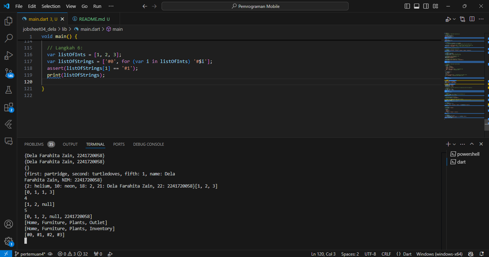

# Nama  : Dela Farahita Zain
# NIM   : 2241720058
# Kelas : D-IV TI / 3B

# Tugas Praktikum
1. Silakan selesaikan Praktikum 1 sampai 5, lalu dokumentasikan berupa screenshot hasil pekerjaan Anda beserta penjelasannya!
## Praktikum 1: Eksperimen Tipe Data List
### Langkah 1:
Ketik atau salin kode program berikut ke dalam void main().
```
var list = [1, 2, 3];
assert(list.length == 3);
assert(list[1] == 2);
print(list.length);
print(list[1]);

list[1] = 1;
assert(list[1] == 1);
print(list[1]);
```
### Langkah 2:
Silakan coba eksekusi (Run) kode pada langkah 1 tersebut. Apa yang terjadi? Jelaskan!

Output ketika kode tersebut di eksekusi yaitu muncul angka 3,2,1. Hal tersebut terjadi karena kode tersebut merupakan List fixed-length yang memiliki nama list dengan elemen 1,2,3. assert(list.length == 3); digunakan untuk mengecek jika panjang list 3, maka kode akan dijalankan. assert(list[1] == 2); digunakan untuk mengecek indeks ke-1 adalah 2. Lalu kode akan menampilkan panjang list 3 dan elemen indeks ke-1 yaitu 2. Kemudian mengubah elemen pada indeks ke-1 dari 2 menjadi 1 menggunakan kode list[1] = 1;. Kode assert(list[1] == 1); mengecek apakah elemen pada indeks ke-1 sekarang adalah 1 dan terakhir, hasil akan ditampilkan jika benar.

### Langkah 3:
Ubah kode pada langkah 1 menjadi variabel final yang mempunyai index = 5 dengan default value = null. Isilah nama dan NIM Anda pada elemen index ke-1 dan ke-2. Lalu print dan capture hasilnya.
Apa yang terjadi ? Jika terjadi error, silakan perbaiki.
Terjadi error ketika kode di eksekusi.

Perbaikan kode:


## Praktikum 2: Eksperimen Tipe Data Set
### Langkah 1:
Ketik atau salin kode program berikut ke dalam fungsi main().
```
var halogens = {'fluorine', 'chlorine', 'bromine', 'iodine', 'astatine'};
print(halogens);
```

### Langkah 2:
Silakan coba eksekusi (Run) kode pada langkah 1 tersebut. Apa yang terjadi? Jelaskan! Lalu perbaiki jika terjadi error.

Output yang dihasilkan setelah kode tersebut di eksekusi yaitu fluorine, chlorine, bromine, iodine, astatine.

### Langkah 3:
Tambahkan kode program berikut, lalu coba eksekusi (Run) kode Anda.
```
var names1 = <String>{};
Set<String> names2 = {}; // This works, too.
var names3 = {}; // Creates a map, not a set.

print(names1);
print(names2);
print(names3);
```
Apa yang terjadi ? Jika terjadi error, silakan perbaiki namun tetap menggunakan ketiga variabel tersebut. Tambahkan elemen nama dan NIM Anda pada kedua variabel Set tersebut dengan dua fungsi berbeda yaitu .add() dan .addAll(). Untuk variabel Map dihapus, nanti kita coba di praktikum selanjutnya.

Ouput dari kode tersebut tidak dapat tampil dikarenakan variabel name1, name2, dan name3 tidak di inisialisasi.
Perbaikan kode:


## Praktikum 3: Eksperimen Tipe Data Maps
### Langkah 1:
Ketik atau salin kode program berikut ke dalam fungsi main().
```
var gifts = {
  // Key:    Value
  'first': 'partridge',
  'second': 'turtledoves',
  'fifth': 1
};

var nobleGases = {
  2: 'helium',
  10: 'neon',
  18: 2,
};

print(gifts);
print(nobleGases);
```

### Langkah 2:
Silakan coba eksekusi (Run) kode pada langkah 1 tersebut. Apa yang terjadi? Jelaskan! Lalu perbaiki jika terjadi error.

Variabel gifts merupakan sebuah Map dengan tipe String sebagai key dan tipe campuran (String atau int) sebagai value.
Variabel nobleGases merupakan sebuah Map dengan tipe int sebagai key dan nilai bertipe campuran (String atau int) sebagai value.

### Langkah 3:
Tambahkan kode program berikut, lalu coba eksekusi (Run) kode Anda.
```
var mhs1 = Map<String, String>();
gifts['first'] = 'partridge';
gifts['second'] = 'turtledoves';
gifts['fifth'] = 'golden rings';

var mhs2 = Map<int, String>();
nobleGases[2] = 'helium';
nobleGases[10] = 'neon';
nobleGases[18] = 'argon';
```
Apa yang terjadi ? Jika terjadi error, silakan perbaiki.

mhs1 adalah sebuah Map yang dideklarasikan dengan tipe key dan value keduanya bertipe String. 
```
gifts['first'] = 'partridge';
gifts['second'] = 'turtledoves';
gifts['fifth'] = 'golden rings'; 
```
Kode tersebut menambahkan pasangan key-value ke dalam Map gifts yang sebelumnya sudah dideklarasikan.
mhs2 adalah sebuah Map yang dideklarasikan dengan tipe key bertipe int dan value bertipe String.
```
nobleGases[2] = 'helium';
nobleGases[10] = 'neon';
nobleGases[18] = 'argon';
```
Kode tersebut menambahkan pasangan key-value ke dalam Map nobleGases.

Tambahkan elemen nama dan NIM Anda pada tiap variabel di atas (gifts, nobleGases, mhs1, dan mhs2). Dokumentasikan hasilnya dan buat laporannya!


## Praktikum 4: Eksperimen Tipe Data List: Spread dan Control-flow Operators
### Langkah 1:
Ketik atau salin kode program berikut ke dalam fungsi main().
```
var list = [1, 2, 3];
var list2 = [0, ...list];
print(list1);
print(list2);
print(list2.length);
```
### Langkah 2:
Silakan coba eksekusi (Run) kode pada langkah 1 tersebut. Apa yang terjadi? Jelaskan! Lalu perbaiki jika terjadi error.

Terjadi error ketika kode tersebut di eksekusi, hal tersebut dikarenakan variabel list sudah ada.
Perbaikan kode:


### Langkah 3:
Tambahkan kode program berikut, lalu coba eksekusi (Run) kode Anda.
```
list1 = [1, 2, null];
print(list1);
var list3 = [0, ...?list1];
print(list3.length);
```
Apa yang terjadi ? Jika terjadi error, silakan perbaiki.

Terjadi error ketika kode di eksekusi, hal tersebut dikarenakan variabel dengan tipe data int tidak dapat mempunyai nilai null. 
Perbaikan kode:

Menggunakan List<int?> agar elemen dapat bernilai null.

Tambahkan variabel list berisi NIM Anda menggunakan Spread Operators. Dokumentasikan hasilnya dan buat laporannya!


### Langkah 4:
Tambahkan kode program berikut, lalu coba eksekusi (Run) kode Anda.
```
var nav = ['Home', 'Furniture', 'Plants', if (promoActive) 'Outlet'];
print(nav);
```
Apa yang terjadi ? Jika terjadi error, silakan perbaiki. Tunjukkan hasilnya jika variabel promoActive ketika true dan false.

Terjadi error pada kode program tersebut ketika di eksekusi, hal tersebut dikarenakan variabel promoActive belum dideklarasikan.
Perbaikan kode:


### Langkah 5:
Tambahkan kode program berikut, lalu coba eksekusi (Run) kode Anda.
```
var nav2 = ['Home', 'Furniture', 'Plants', if (login case 'Manager') 'Inventory'];
print(nav2);
```
Apa yang terjadi ? Jika terjadi error, silakan perbaiki. Tunjukkan hasilnya jika variabel login mempunyai kondisi lain.

Terjadi error pada kode program tersebut ketika di eksekusi, hal tersebut dikarenakan variabel login belum dideklarasikan dan sintaks case digunakan dalam pernyataan switch bukan if.
Perbaikan kode:


### Langkah 6:
Tambahkan kode program berikut, lalu coba eksekusi (Run) kode Anda.
```
var listOfInts = [1, 2, 3];
var listOfStrings = ['#0', for (var i in listOfInts) '#$i'];
assert(listOfStrings[1] == '#1');
print(listOfStrings);
```
Apa yang terjadi ? Jika terjadi error, silakan perbaiki. Jelaskan manfaat Collection For dan dokumentasikan hasilnya.

Output dari kode program tersebut menghasilkan #0, #1, #2, #3.
Manfaat dair Collection For yaitu mmebuat kode menjadi lebih ringkas, kita dapat membuat list baru berdasarkan list yang sudah ada dengan cara yang lebih ringkas dan jelas dibandingkan dengan menggunakan loop biasa.

## Praktikum 5: Eksperimen Tipe Data Records
### Langkah 1:
Ketik atau salin kode program berikut ke dalam fungsi main().
```
var record = ('first', a: 2, b: true, 'last');
print(record)
```
### Langkah 2:
Silakan coba eksekusi (Run) kode pada langkah 1 tersebut. Apa yang terjadi? Jelaskan! Lalu perbaiki jika terjadi error.

Terjadi error pada kode program tersebut ketika di eksekusi, hal tersebut dikarenakan kurangnya tanda titik koma (;).
Perbaikan kode:


### Langkah 3:
Tambahkan kode program berikut di luar scope void main(), lalu coba eksekusi (Run) kode Anda.
```
(int, int) tukar((int, int) record) {
  var (a, b) = record;
  return (b, a);
}
```
Apa yang terjadi ? Jika terjadi error, silakan perbaiki. Gunakan fungsi tukar() di dalam main() sehingga tampak jelas proses pertukaran value field di dalam Records.

Fungsi tukar() di dalam main() digunakan untuk menukar 2 elemen (a,b) menjadi elemen (b,a), sehingga menghasilkan output nilai 1,2 menjadi 2,1.

### Langkah 4:
Tambahkan kode program berikut di dalam scope void main(), lalu coba eksekusi (Run) kode Anda.
```
// Record type annotation in a variable declaration:
(String, int) mahasiswa;
print(mahasiswa);
```
Apa yang terjadi ? Jika terjadi error, silakan perbaiki. Inisialisasi field nama dan NIM Anda pada variabel record mahasiswa di atas. Dokumentasikan hasilnya dan buat laporannya!

Terjadi error pada kode program tersebut ketika di eksekusi, hal tersebut dikarenakan variabel mahasiswa bertipe non-nullable perlu diinisialisasi sebelum digunakan.
Perbaikan kode:


### Langkah 5:
Tambahkan kode program berikut di dalam scope void main(), lalu coba eksekusi (Run) kode Anda.
```
var mahasiswa2 = ('first', a: 2, b: true, 'last');

print(mahasiswa2.$1); // Prints 'first'
print(mahasiswa2.a); // Prints 2
print(mahasiswa2.b); // Prints true
print(mahasiswa2.$2); // Prints 'last'
```
Apa yang terjadi ? Jika terjadi error, silakan perbaiki. Gantilah salah satu isi record dengan nama dan NIM Anda, lalu dokumentasikan hasilnya dan buat laporannya!

Varibel mahasiswa2 digunakan untuk menyimpan record yang berisi elemen-elemen dengan kombinasi posisi (print(mahasiswa2.$1); dan print(mahasiswa2.$2);) dan elemen bernama (print(mahasiswa2.a); dan print(mahasiswa2.b);).
Mengganti salah satu isi record dengan nama dan NIM:


2. Jelaskan yang dimaksud Functions dalam bahasa Dart!
Functions merupakan blok kode yang dapat dipanggil untuk menjalankan tugas tertentu. Functions dapat memiliki parameter yaitu nilai yang diterima oleh Functions saat dipanggil.

3. Jelaskan jenis-jenis parameter di Functions beserta contoh sintaksnya!
- Positional Parameters (Parameter Wajib): harus diisi saat pemanggilan.
Contoh sintaks:
```
void positionalParam(String nama, int nim) {
  print('Halo, nama saya $nama! NIM saya $nim');
}

positionalParam('Dela Farahita Zain', 2241720058); // Output: Nama: Dela Farahita Zain, NIM: 2241720058
```
- Named Parameters (Parameter Bernama): ditandai dengan {} dan bisa bersifat opsional atau wajib. Kita dapat memberikan nilai default atau menandainya sebagai required.
Contoh sintaks:
```
void namedParam({required String nama, required int nim}) {
  print('Nama: $nama, NIM: $nim');
}

namedParam(nama: 'Dela Farahita Zain', nim: 2241720058); // Output: Nama: Dela Farahita Zain, NIM: 2241720058
```
- Optional Positional Parameters (Parameter Opsional) ditandai dengan [] dan dapat memiliki nilai default. Jika tidak ada nilai default, maka tipe parameter harus nullable.
Contoh sintaks:
```
String optionalPositionalParam(String nama, int nim, [String? prodi]) {
  var result = 'Nama: $nama, NIM: $nim';
  if (prodi != null) {
    result = '$result, Prodi: $prodi';
  }
  return result;
}
print(optionalPositionalParam('Dela Farahita Zain', 2241720058)); // Ouput: Nama: Dela Farahita Zain, NIM: 2241720058
print(optionalPositionalParam('Dela Farahita Zain', 2241720058, 'D4-TI')); // Output Nama: Dela Farahita Zain, NIM: 2241720058, Prodi: D4-TI
```

4. Jelaskan maksud Functions sebagai first-class objects beserta contoh sintaknya!
Functions sebagai first-class objects berarti kita dapat mengirimkan fungsi sebagai parameter ke fungsi lain, menyimpannya dalam variabel, atau mengembalikannya dari fungsi lain.
Contoh sintaks:
```
// Fungsi untuk memperkenalkan diri
void introduce(String name, int nim) {
  print('Nama: $name, NIM: $nim');
}

// Fungsi yang menerima fungsi perkenalan sebagai parameter
void executeIntroduction(void Function(String, int) introductionFunction) {
  introductionFunction('Dela Farahita Zain', 2241720058);  // Memanggil fungsi yang diberikan
}

// Memanggil fungsi executeIntroduction dengan fungsi introduce
executeIntroduction(introduce);
```

5. Apa itu Anonymous Functions? Jelaskan dan berikan contohnya!
Anonymous Functions adalah fungsi tanpa nama untuk digunakan secara langsung, biasanya sebagai argumen untuk fungsi lain.
```
void main() {
  const list = ['Mawar', 'Melati', 'Lilly'];

  // Menggunakan anonymous function untuk mengubah setiap item menjadi huruf kapital
  var uppercaseList = list.map((item) {
    return item.toUpperCase();
  }).toList();

  // Mencetak setiap item dan panjangnya
  uppercaseList.forEach((item) {
    print('$item: ${item.length}');
  });
}
```

6. Jelaskan perbedaan Lexical scope dan Lexical closures! Berikan contohnya!
Lexical Scope: Menentukan variabel mana yang dapat diakses berdasarkan lokasi kode dalam blok {}.
Contoh:
```
void main() {
  var outerVariable = 'Saya di luar';

  void innerFunction() {
    var innerVariable = 'Saya di dalam';
    print(outerVariable); // Bisa diakses
    print(innerVariable); // Bisa diakses
  }

  innerFunction();

  // print(innerVariable); // Error: Tidak bisa diakses di sini
}
```
Lexical Closures: Fungsi yang dapat mengingat variabel dari lingkup luar saat fungsi tersebut didefinisikan, bahkan ketika sudah dieksekusi di luar lingkup itu.
Contoh:
```
Function createMultiplier(int multiplier) {
  return (int number) => multiplier * number;
}

void main() {
  var multiplyBy2 = createMultiplier(2); // Fungsi closure yang mengingat multiplier = 2
  var multiplyBy3 = createMultiplier(3); // Fungsi closure yang mengingat multiplier = 3

  print(multiplyBy2(5)); // Output: 10
  print(multiplyBy3(5)); // Output: 15
}
```

7. Jelaskan dengan contoh cara membuat return multiple value di Functions!
Functions di Dart tidak dapat langsung mengembalikan beberapa nilai secara terpisah. Namun, kita bisa menggunakan beberapa cara, seperti menggunakan tuples (record), list, atau map. 
Contoh menggunakan Record:
```
// Fungsi yang mengembalikan nama dan NIM menggunakan record
(String, int) getNameAndNim() {
  String name = 'Dela Farahita Zain';
  int nim = 2241720058;
  return (name, nim);  // Mengembalikan beberapa nilai sebagai tuple
}

void main() {
  var (name, nim) = getNameAndNim();  // Memecah nilai yang dikembalikan
  print('Nama: $name, NIM: $nim');
}
```

