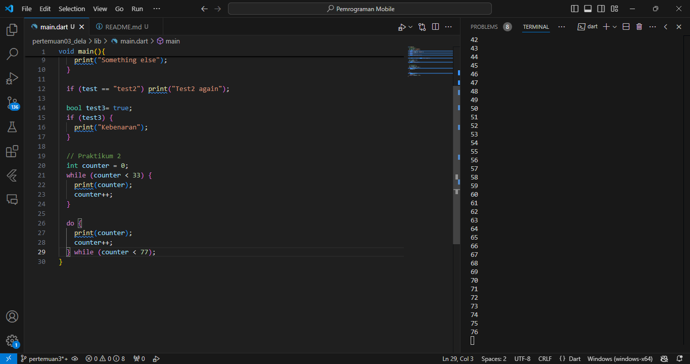
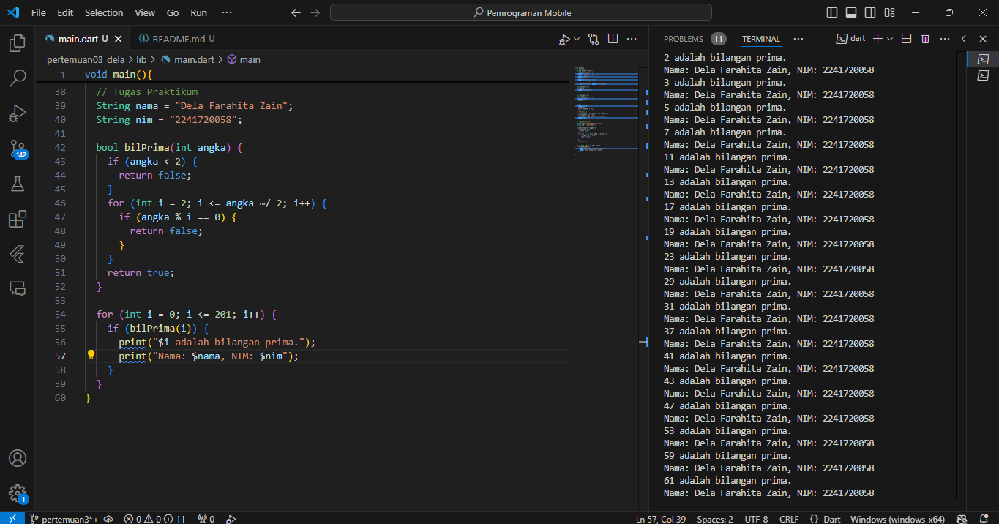

# Nama  : Dela Farahita Zain
# NIM   : 2241720058
# Kelas : D-IV TI / 3B

# Tugas Praktikum

1. Silakan selesaikan Praktikum 1 sampai 3, lalu dokumentasikan berupa screenshot hasil pekerjaan beserta penjelasannya!\
## Praktikum 1: Menerapkan Control Flows ("if/else")
Langkah 1:
Ketik atau salin kode program berikut ke dalam fungsi main().
```
String test = "test2";
if (test == "test1") {
   print("Test1");
} else If (test == "test2") {
   print("Test2");
} Else {
   print("Something else");
}

if (test == "test2") print("Test2 again");
```
Langkah 2:
Silakan coba eksekusi (Run) kode pada langkah 1 tersebut. Apa yang terjadi? Jelaskan!

Terjadi error ketika kode tersebut di eksekusi, hal tersebut dikarenakan terdapat penulisan kode yang salah, yaitu 'else If' seharusnya 'else if' dan 'Else' seharusnya 'else'.
Perbaikan kode:

Langkah 3:
Tambahkan kode program berikut, lalu coba eksekusi (Run) kode Anda.
```
String test = "true";
if (test) {
   print("Kebenaran");
}
```
Apa yang terjadi ? Jika terjadi error, silakan perbaiki namun tetap menggunakan if/else.

Terjadi error ketika kode tersebut di eksekusi, hal tersebut dikarenakan variabel test sudah di deklarasikan dan variabel tersebut di deklarasikan dengan tipe String sedangkan terdapat kondisi if dengan nilai boolean. Sehingga tipe data String harus diganti menggunakan tipe data boolean.
Perbaikan kode:

## Praktikum 2: Menerapkan Perulangan "while" dan "do-while"
Langkah 1:
Ketik atau salin kode program berikut ke dalam fungsi main().
```
while (counter < 33) {
  print(counter);
  counter++;
}
```
Langkah 2:
Silakan coba eksekusi (Run) kode pada langkah 1 tersebut. Apa yang terjadi? Jelaskan! Lalu perbaiki jika terjadi error.

Terjadi error ketika kode tersebut di eksekusi, hal tersebut dikarenakan variabel counter belum dideklarasikan dan diinisialisasi.
Perbaikan kode:

Langkah 3:
Tambahkan kode program berikut, lalu coba eksekusi (Run) kode Anda.
```
do {
  print(counter);
  counter++;
} while (counter < 77);
```
Apa yang terjadi ? Jika terjadi error, silakan perbaiki namun tetap menggunakan do-while.
Tidak terjadi error pada kode tersebut. Kode program tersebut akan menghasilkan output mulai dari angka 0 hingga angka 76, dikarenakan variabel counter bernilai 0 dan akan melakukan perulangan hingga angka dibawah 77, yaitu angka 76.
Output:

## Praktikum 3: Menerapkan Perulangan "for" dan "break-continue"
Langkah 1:
Ketik atau salin kode program berikut ke dalam fungsi main().
```
for (Index = 10; index < 27; index) {
  print(Index);
}
```
Langkah 2:
Silakan coba eksekusi (Run) kode pada langkah 1 tersebut. Apa yang terjadi? Jelaskan! Lalu perbaiki jika terjadi error.

Terjadi error ketika kode tersebut di eksekusi, hal tersebut dikarenakan nama variabel Index tidak sama, sehingga harus disamakan menjadi index. Dan juga tipe data variabel index belum di deklarasikan. Selain itu, inkrementasi variabel index harus diperbaiki menjadi index++ agar  tidak terjadi infinite loop.
Perbaikan kode:

Langkah 3:
Tambahkan kode program berikut di dalam for-loop, lalu coba eksekusi (Run) kode Anda.
```
If (Index == 21) break;
Else If (index > 1 || index < 7) continue;
print(index);
```
Apa yang terjadi ? Jika terjadi error, silakan perbaiki namun tetap menggunakan for dan break-continue.


Terjadi error ketika kode tersebut di eksekusi, hal tersebut dikarenakan terdapat kesalahan penulisan huruf kapital.
Perbaikan kode:


2. Buatlah sebuah program yang dapat menampilkan bilangan prima dari angka 0 sampai 201 menggunakan Dart. Ketika bilangan prima ditemukan, maka tampilkan nama lengkap dan NIM Anda.



3. Kumpulkan berupa link commit repo GitHub pada tautan yang telah disediakan di grup Telegram!
