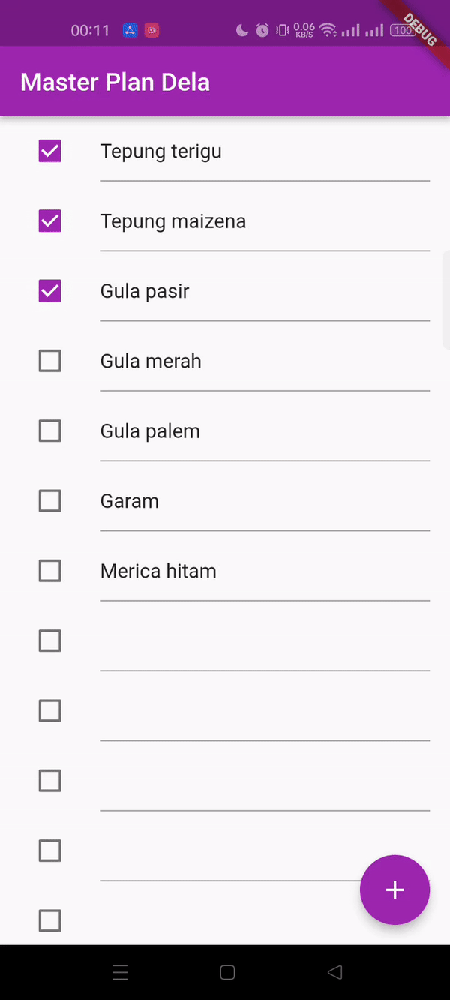
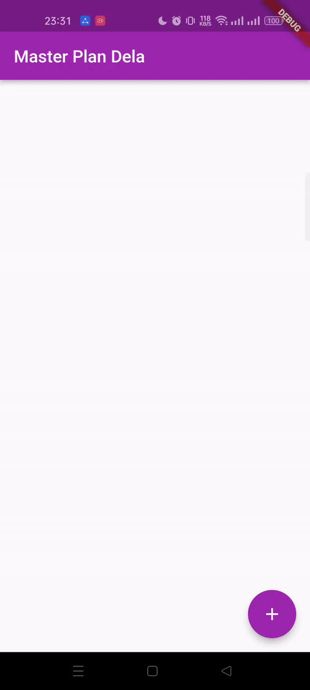
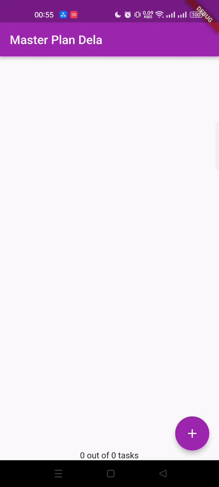
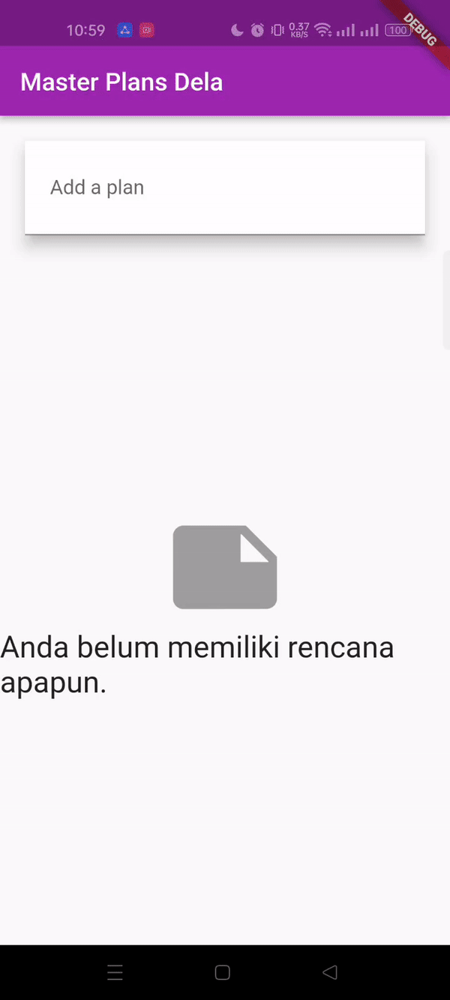

# Nama: Dela Farahita Zain
# Kelas: D4-TI/3B
# NIM: 2241720058

# Tugas Praktikum 1: Dasar State dengan Model-View
1. Selesaikan langkah-langkah praktikum tersebut, lalu dokumentasikan berupa GIF hasil akhir praktikum beserta penjelasannya di file README.md! Jika Anda menemukan ada yang error atau tidak berjalan dengan baik, silakan diperbaiki.
## Hasil

Pada Praktikum 1 kita pembuatan aplikasi yang memiliki fitur scrollable list yang dapat menampilkan daftar tugas, sehingga pengguna dapat menambah, mengedit, dan mencentang status tugas. Selain itu, terdapat juga fitur untuk menangani keyboard saat pengguna berinteraksi dengan input teks.

2. Jelaskan maksud dari langkah 4 pada praktikum tersebut! Mengapa dilakukan demikian?
Pada langkah 4 pembuatan file data_layer.dart yang bertujuan untuk menghubungkan model Task dan Plan secara lebih terorganisir. File ini mengekspor kedua model tersebut, sehingga saat model Task dan Plan diperlukan di bagian lain proyek, kita cukup mengimpor data_layer.dart. Ini menyederhanakan proses impor dan membuat kode lebih rapi serta mudah dikelola.

3. Mengapa perlu variabel plan di langkah 6 pada praktikum tersebut? Mengapa dibuat konstanta ?
Variabel plan pada Langkah 6 adalah instance dari class Plan yang menyimpan daftar tugas dalam aplikasi. Variabel ini berfungsi melacak dan menampilkan semua tugas yang ada. plan dibuat sebagai konstanta (const Plan()) saat pertama kali diinisialisasi karena daftar awalnya kosong dan tidak memerlukan perubahan. Menggunakan const di sini lebih efisien dan menunjukkan bahwa nilai awal plan tetap. Seiring berjalannya aplikasi, plan akan diperbarui setiap kali ada tugas yang ditambahkan atau diubah.

4. Lakukan capture hasil dari Langkah 9 berupa GIF, kemudian jelaskan apa yang telah Anda buat!
## Hasil

Pada Langkah 9, kita membuat widget _buildTaskTile untuk menampilkan daftar tugas menggunakan ListTile, di mana setiap tugas memiliki Checkbox dan TextFormField:
- Checkbox: Menunjukkan status penyelesaian tugas yang bisa dicentang atau tidak. Ketika status berubah, data tugas diperbarui menggunakan setState.
- TextFormField: Menampilkan deskripsi tugas yang dapat diubah, dan setiap perubahan akan memperbarui data tugas yang bersangkutan.

5. Apa kegunaan method pada Langkah 11 dan 13 dalam lifecyle state ?
- Langkah 11 (initState Method):
initState adalah bagian dari siklus hidup widget yang dieksekusi sekali saat widget pertama kali dibuat. Di sini, initState digunakan untuk menginisialisasi ScrollController dan menambahkan listener yang akan menghilangkan fokus dari TextField ketika layar digulir. Ini membantu mencegah masalah UI yang mungkin timbul ketika keyboard muncul selama scroll.
- Langkah 13 (dispose Method):
dispose digunakan untuk membersihkan resource yang tidak lagi diperlukan ketika widget dihapus dari tampilan. Di sini, dispose membuang ScrollController saat PlanScreen tidak lagi aktif, yang membantu mencegah kebocoran memori.

# Tugas Praktikum 2: InheritedWidget
1. Selesaikan langkah-langkah praktikum tersebut, lalu dokumentasikan berupa GIF hasil akhir praktikum beserta penjelasannya di file README.md! Jika Anda menemukan ada yang error atau tidak berjalan dengan baik, silakan diperbaiki sesuai dengan tujuan aplikasi tersebut dibuat.
## Hasil

Pada Praktikum 2, kita memisahkan data todo list ke luar dari class view menggunakan InheritedWidget dan InheritedNotifier untuk mengelola state data yang dapat dibagikan di antara widget turunannya.

2. Jelaskan mana yang dimaksud InheritedWidget pada langkah 1 tersebut! Mengapa yang digunakan InheritedNotifier?
Pada langkah 1, InheritedWidget digunakan untuk memungkinkan data dari widget diakses oleh widget turunannya. Namun, pada praktikum 2, yang digunakan adalah InheritedNotifier. InheritedNotifier adalah subclass dari InheritedWidget yang lebih cocok untuk data yang bersifat dinamis dan dapat berubah. Dengan menggunakan ValueNotifier di dalam InheritedNotifier, kita bisa mengelola data yang reaktif, di mana setiap perubahan data akan memperbarui tampilan widget yang mengandalkan data tersebut.

3. Jelaskan maksud dari method di langkah 3 pada praktikum tersebut! Mengapa dilakukan demikian?
- completedCount: Menghitung jumlah task yang sudah selesai dengan memfilter list tasks dan menghitung yang memiliki status complete bernilai true.
- completenessMessage: Mengembalikan string yang menunjukkan seberapa banyak task yang selesai dibandingkan dengan total task.
Kedua method ini digunakan untuk memberi informasi dinamis tentang progres penyelesaian task yang dapat ditampilkan pada aplikasi.

4. Lakukan capture hasil dari Langkah 9 berupa GIF, kemudian jelaskan apa yang telah Anda buat!
## Hasil

Output yang dihasilkan menunjukkan bagaimana progres task berubah setiap kali ada task yang selesai. Ini mengilustrasikan cara aplikasi secara dinamis menampilkan data yang diperbarui.

# Tugas Praktikum 3: State di Multiple Screens
1. Selesaikan langkah-langkah praktikum tersebut, lalu dokumentasikan berupa GIF hasil akhir praktikum beserta penjelasannya di file README.md! Jika Anda menemukan ada yang error atau tidak berjalan dengan baik, silakan diperbaiki sesuai dengan tujuan aplikasi tersebut dibuat.
## Hasil

2. Berdasarkan Praktikum 3 yang telah Anda lakukan, jelaskan maksud dari gambar diagram berikut ini!

Diagram ini menggambarkan perpindahan antara layar awal (PlanCreatorScreen) ke layar detail (PlanScreen) dengan menggunakan Navigator Push.
Diagram Kiri (PlanCreatorScreen):
- Di sisi kiri, aplikasi dimulai dengan widget MaterialApp sebagai widget root.
    - PlanProvider menyediakan akses ke data yang dikelola (misalnya, daftar rencana/tugas).
    - PlanCreatorScreen adalah layar awal, yang diatur dalam struktur kolom (Column).
    - TextField digunakan untuk menambahkan rencana baru.
    - ListView di dalam Expanded menampilkan daftar rencana yang sudah ada.
- Diagram Kanan (PlanScreen):
    - Navigator Push digunakan untuk menavigasi ke layar berikutnya (PlanScreen) ketika sebuah rencana dipilih.
    - Di layar PlanScreen, Scaffold digunakan sebagai kerangka tata letak utama.
    - Struktur dalam PlanScreen menggunakan Column untuk menampilkan daftar tugas dalam rencana yang dipilih.
    - Di dalam Column, ada Expanded yang menampung ListView untuk menampilkan daftar tugas, dan SafeArea yang menampilkan Text sebagai pesan tambahan.
3. Lakukan capture hasil dari Langkah 14 berupa GIF, kemudian jelaskan apa yang telah Anda buat!
## Hasil
