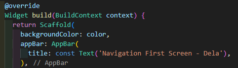

# Nama: Dela Farahita Zain
# Kelas: D4-TI/3B
# NIM: 2241720058

# Praktikum 1: Mengunduh Data dari Web Service (API)
## Soal 1
Tambahkan nama panggilan Anda pada title app sebagai identitas hasil pekerjaan Anda.

## Soal 2
- Carilah judul buku favorit Anda di Google Books, lalu ganti ID buku pada variabel path di kode tersebut. Caranya ambil di URL browser Anda seperti gambar berikut ini.
  
- Kemudian cobalah akses di browser URI tersebut dengan lengkap seperti ini. Jika menampilkan data JSON, maka Anda telah berhasil. Lakukan capture milik Anda dan tulis di README pada laporan praktikum.
  
## Soal 3
- Jelaskan maksud kode langkah 5 tersebut terkait substring dan catchError!
  Langkah 5 dalam kode menggunakan `substring` dan `catchError` untuk mengelola data dan penanganan kesalahan. Metode `substring(0, 450)` mengambil 450 karakter pertama dari teks yang diterima agar data yang ditampilkan tidak terlalu panjang di layar. Sedangkan, `catchError` menangani kesalahan yang mungkin terjadi saat mengambil data, seperti masalah koneksi internet, dengan menampilkan pesan `'An error occurred'` di layar.
- Capture hasil praktikum Anda berupa GIF dan lampirkan di README.
  

# Praktikum 2: Menggunakan await/async untuk menghindari callbacks
## Soal 4
- Jelaskan maksud kode langkah 1 dan 2 tersebut!
    - Pada langkah 1, tiga metode (returnOneAsync, returnTwoAsync, dan returnThreeAsync) ditambahkan, masing-masing mengembalikan angka 1, 2, dan 3 setelah jeda 3 detik, yang mensimulasikan proses pemrosesan data yang memakan waktu. 
    - Di langkah 2, metode tambahan bernama count ditambahkan di bawah ketiga metode tersebut, dan metode ini berfungsi untuk mengambil atau mengelola hasil dari ketiga metode sebelumnya. Misalnya, metode count bisa digunakan untuk menjumlahkan hasil dari ketiga metode tersebut atau menjalankan ketiganya secara bersamaan.
- Capture hasil praktikum Anda berupa GIF dan lampirkan di README.
  

# Praktikum 3: Menggunakan Completer di Future
## Soal 5
- Jelaskan maksud kode langkah 2 tersebut!
Langkah 2 menambahkan variabel dan metode untuk menangani operasi asinkron. Variabel `completer` bertipe `Completer<int>` yang digunakan untuk mengelola penyelesaian sebuah `Future`. Method `getNumber()` menginisialisasi `completer`, kemudian memanggil method `calculate()`, yang akan menunda eksekusi selama 5 detik dan kemudian menyelesaikan `completer` dengan nilai 42. Dengan ini, `completer.future` akan menunggu selama 5 detik dan mengembalikan hasil berupa angka 42 setelah proses selesai. Tujuan dari langkah ini adalah untuk membuat sebuah proses asinkron yang dapat diselesaikan pada waktu tertentu dan menghasilkan nilai yang dapat diproses lebih lanjut.
- Capture hasil praktikum Anda berupa GIF dan lampirkan di README.

## Soal 6
- Jelaskan maksud perbedaan kode langkah 2 dengan langkah 5-6 tersebut!
Perbedaan antara kode di Langkah 2 dan Langkah 5-6 terletak pada penanganan kesalahan. Pada Langkah 2, method `calculate()` hanya menunggu 5 detik dan menyelesaikan `Completer` dengan nilai 42 tanpa menangani kemungkinan kesalahan. Sedangkan di Langkah 5, `calculate()` diperbarui dengan `try-catch` block untuk menangani kesalahan yang mungkin terjadi selama eksekusi, sehingga jika ada masalah, error bisa ditangani dengan lebih baik. Pada Langkah 6, saat memanggil `getNumber()`, hasilnya diproses menggunakan `.then()` untuk menangani nilai yang berhasil dan `.catchError()` untuk menangani error, memberikan cara yang lebih aman dan jelas dalam menangani hasil atau kesalahan asinkron. Jadi, langkah-langkah ini menambahkan penanganan error untuk membuat aplikasi lebih stabil.
- Capture hasil praktikum Anda berupa GIF dan lampirkan di README.

# Praktikum 4: Memanggil Future secara paralel
## Soal 7
Capture hasil praktikum Anda berupa GIF dan lampirkan di README.

## Soal 8
Jelaskan maksud perbedaan kode langkah 1 dan 4!
Perbedaan antara kode di langkah 1 dan langkah 4 terletak pada cara menangani beberapa `Future` secara bersamaan. Di langkah 1, digunakan `Future.wait()` untuk menunggu hasil dari beberapa `Future`, lalu hasilnya diproses dengan `then()` untuk menghitung total dan `catchError()` untuk menangani error. Kode ini dipanggil dalam metode terpisah yang membuatnya lebih terstruktur. Sementara itu, langkah 4 juga menggunakan `Future.wait()` untuk menjalankan beberapa `Future` secara bersamaan, namun hasilnya hanya disimpan dalam variabel dan tidak langsung diproses. Langkah 4 lebih sederhana dan biasanya digunakan untuk situasi di mana pemrosesan hasil dilakukan di tempat lain.

# Praktikum 5: Menangani Respon Error pada Async Code
## Soal 9
Capture hasil praktikum Anda berupa GIF dan lampirkan di README.

## Soal 10
Panggil method handleError() tersebut di ElevatedButton, lalu run. Apa hasilnya? Jelaskan perbedaan kode langkah 1 dan 4!
Langkah 1 lebih berfokus pada penyelesaian operasi async menggunakan Completer, sedangkan langkah 4 lebih berfokus pada penanganan error menggunakan blok try-catch untuk menangani dan menampilkan error dalam aplikasi.

# Praktikum 6: Menggunakan Future dengan StatefulWidget
## Soal 11
Tambahkan nama panggilan Anda pada tiap properti title sebagai identitas pekerjaan Anda.

## Soal 12
- Jika Anda tidak melihat animasi loading tampil, kemungkinan itu berjalan sangat cepat. Tambahkan delay pada method getPosition() dengan kode await Future.delayed(const Duration(seconds: 3));
- Apakah Anda mendapatkan koordinat GPS ketika run di browser? Mengapa demikian?
Ketika menjalankan di browser maupun android, kita mendapatkan koordinat GPS ketika kita mengijinkan akses ke GPS pada perangkat.
- Capture hasil praktikum Anda berupa GIF dan lampirkan di README.

# Praktikum 7: Manajemen Future dengan FutureBuilder
## Soal 13
- Apakah ada perbedaan UI dengan praktikum sebelumnya? Mengapa demikian?
Iya, ada perbedaan UI dengan praktikum sebelumnya. Karena ketika menggunakan `FutureBuilder`, UI lebih rapi dan efisien karena otomatis menyesuaikan saat `Future` sedang berjalan, berhasil, atau gagal, tanpa perlu mengatur state secara manual seperti pada praktikum sebelumnya. Sehingga kode lebih simpel dan lebih mudah dipahami.
- Capture hasil praktikum Anda berupa GIF dan lampirkan di README.

- Seperti yang Anda lihat, menggunakan FutureBuilder lebih efisien, clean, dan reactive dengan Future bersama UI.
## Soal 14
- Apakah ada perbedaan UI dengan langkah sebelumnya? Mengapa demikian?
Iya, UI-nya berbeda karena sekarang lebih dinamis dan interaktif. Dengan menambahkan `FutureBuilder`, UI bisa menampilkan indikator pemuatan saat data sedang diambil, atau pesan error jika terjadi masalah. Ini membuat tampilan lebih responsif terhadap proses pengambilan data, sehingga pengguna dapat memahami apa yang sedang terjadi tanpa harus menunggu dengan layar kosong.
- Capture hasil praktikum Anda berupa GIF dan lampirkan di README.

# Praktikum 8: Navigation route dengan Future Function
## Soal 15
- Tambahkan nama panggilan Anda pada tiap properti title sebagai identitas pekerjaan Anda.

- Silakan ganti dengan warna tema favorit Anda.

## Soal 16
- Cobalah klik setiap button, apa yang terjadi ? Mengapa demikian ?
Warna tema di layar pertama (NavigationFirst) akan berubah sesuai warna tombol yang di klik pada layar kedua (NavigationSecond):
  - Tombol Pink akan mengubah warna menjadi pink.shade100.
  - Tombol Purple akan mengubah warna menjadi purple.shade700.
  - Tombol Yellow akan mengubah warna menjadi yellow.shade200.
Proses ini terjadi karena setiap tombol menggunakan fungsi `Navigator.pop(context, color)` untuk mengembalikan warna yang dipilih. Setelah warna diterima oleh layar `NavigationFirst`, fungsi `setState` akan memperbarui warna latar belakang sesuai dengan warna yang dipilih. Sehingga, warna latar belakang layar `NavigationFirst` akan berubah sesuai dengan pilihan warna di layar `NavigationSecond`.
- Gantilah 3 warna pada langkah 5 dengan warna favorit Anda!

- Capture hasil praktikum Anda berupa GIF dan lampirkan di README.

# Praktikum 9: Memanfaatkan async/await dengan Widget Dialog
## Soal 17
- Cobalah klik setiap button, apa yang terjadi ? Mengapa demikian ?
Saat kita mengklik setiap tombol di dialog, warna latar belakang layar utama akan berubah sesuai warna tombol yang dipilih (merah muda, ungu, atau kuning). Hal ini dikarenakan fungsi `Navigator.of(context).pop(selectedColor);` digunakan untuk menutup dialog dan mengirimkan warna yang dipilih kembali ke layar utama. Setelah warna diterima di layar utama, metode `setState` dipanggil untuk memperbarui warna latar belakang.
- Gantilah 3 warna pada langkah 3 dengan warna favorit Anda!

- Capture hasil praktikum Anda berupa GIF dan lampirkan di README.
