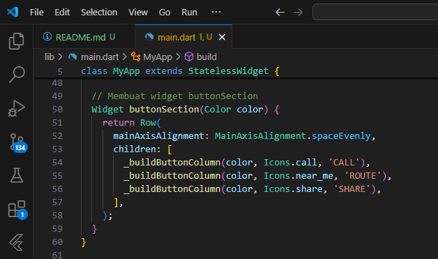
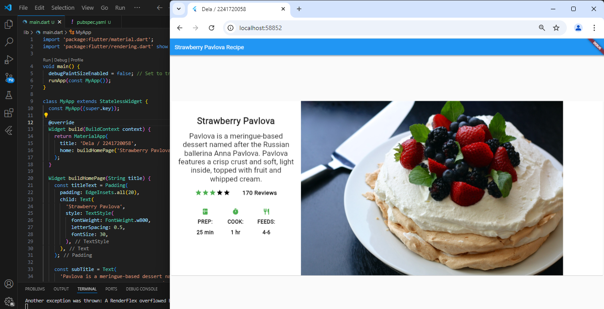
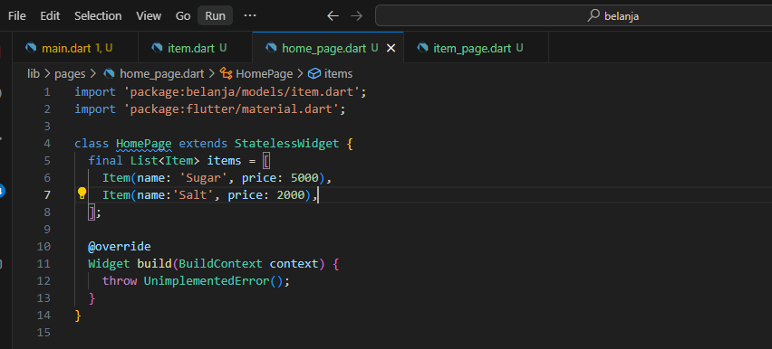
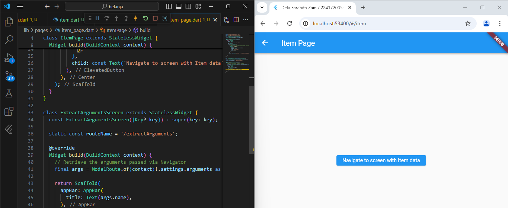
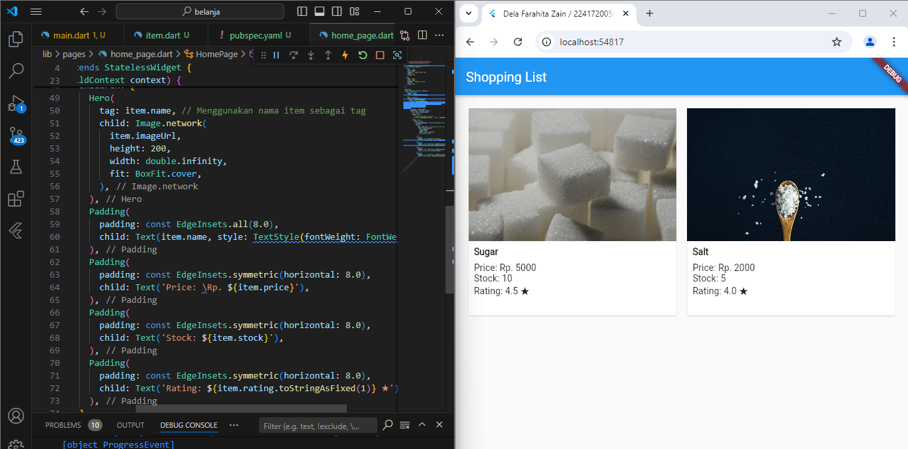

# Nama: Dela Farahita Zain
# NIM: 2241720058
# Kelas: D-IV TI / 3B

# Tugas Praktikum 1
1. Selesaikan Praktikum 1 sampai 4, lalu dokumentasikan dan push ke repository Anda berupa screenshot setiap hasil pekerjaan beserta penjelasannya di file README.md!
2. Silakan implementasikan di project baru "basic_layout_flutter" dengan mengakses sumber ini: https://docs.flutter.dev/codelabs/layout-basics

# Praktikum 1: Membangun Layout di Flutter
## Langkah 1: Buat Project Baru

## Langkah 2: Buka file lib/main.dart

## Langkah 3: Identifikasi layout diagram
## Langkah 4: Implementasi title row


# Praktikum 2: Implementasi button row
## Langkah 1: Buat method Column _buildButtonColumn

## Langkah 2: Buat widget buttonSection 

## Langkah 3: Tambah button section ke body


# Praktikum 3: Implementasi text section
## Langkah 1: Buat widget textSection

## Langkah 2: Tambahkan variabel text section ke body


# Praktikum 4: Implementasi image section
## Langkah 1: Siapkan aset gambar

## Langkah 2: Tambahkan gambar ke body

## Langkah 3: Terakhir, ubah menjadi ListView


# basic_layout_flutter
## Lay out a widget
### 1. Select a layout widget
### 2. Create a visible widget
### 3. Add the visible widget to the layout widget
### 4. Add the layout widget to the page

## Cupertino apps

## Non-Material apps

## Lay out multiple widgets vertically and horizontally
### Aligning widgets

### Sizing widgets


### Packing widgets

### Nesting rows and columns

## Common layout widgets
### Container

### GridView

### ListView

### Stack

### Card


# Praktikum 5: Membangun Navigasi di Flutter
## Langkah 1: Siapkan project baru

## Langkah 2: Mendefinisikan Route


## Langkah 3: Lengkapi Kode di main.dart

## Langkah 4: Membuat data model

## Langkah 5: Lengkapi kode di class HomePage

## Langkah 6: Membuat ListView dan itemBuilder

## Langkah 7: Menambahkan aksi pada ListView


# Tugas Praktikum 2
1. Untuk melakukan pengiriman data ke halaman berikutnya, cukup menambahkan informasi arguments pada penggunaan Navigator. Perbarui kode pada bagian Navigator menjadi seperti berikut.
```
Navigator.pushNamed(context, '/item', arguments: item);
```

2. Pembacaan nilai yang dikirimkan pada halaman sebelumnya dapat dilakukan menggunakan ModalRoute. Tambahkan kode berikut pada blok fungsi build dalam halaman ItemPage. Setelah nilai didapatkan, anda dapat menggunakannya seperti penggunaan variabel pada umumnya. (https://docs.flutter.dev/cookbook/navigation/navigate-with-arguments)
```
final itemArgs = ModalRoute.of(context)!.settings.arguments as Item;
```

3. Pada hasil akhir dari aplikasi belanja yang telah anda selesaikan, tambahkan atribut foto produk, stok, dan rating. Ubahlah tampilan menjadi GridView seperti di aplikasi marketplace pada umumnya.

4. Silakan implementasikan Hero widget pada aplikasi belanja Anda dengan mempelajari dari sumber ini: https://docs.flutter.dev/cookbook/navigation/hero-animations




5. Sesuaikan dan modifikasi tampilan sehingga menjadi aplikasi yang menarik. Selain itu, pecah widget menjadi kode yang lebih kecil. Tambahkan Nama dan NIM di footer aplikasi belanja Anda.


6. Selesaikan Praktikum 5: Navigasi dan Rute tersebut. Cobalah modifikasi menggunakan plugin go_router, lalu dokumentasikan dan push ke repository Anda berupa screenshot setiap hasil pekerjaan beserta penjelasannya di file README.md. Kumpulkan link commit repository GitHub Anda kepada dosen yang telah disepakati!


