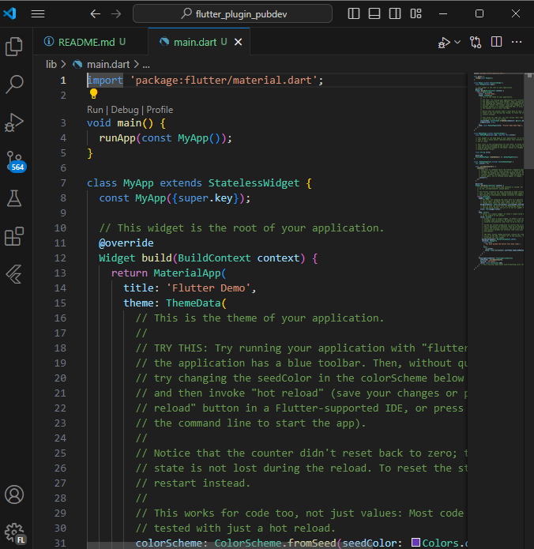
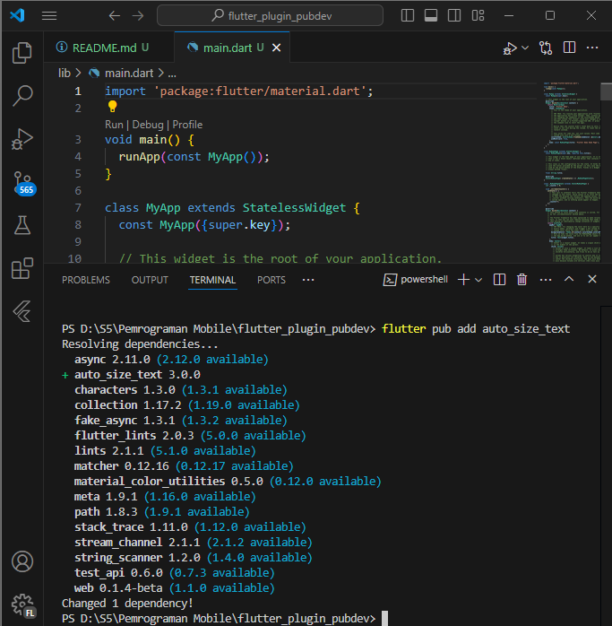
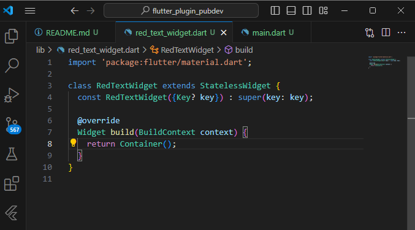
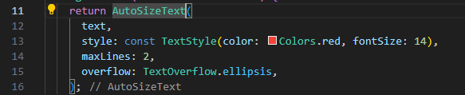
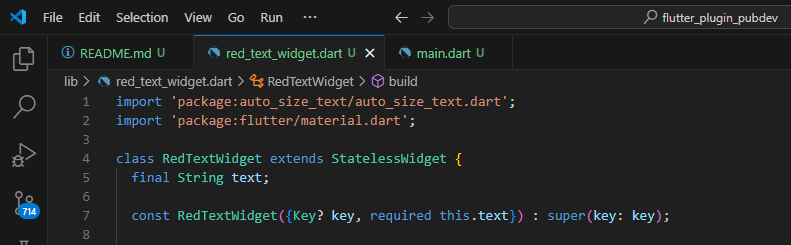
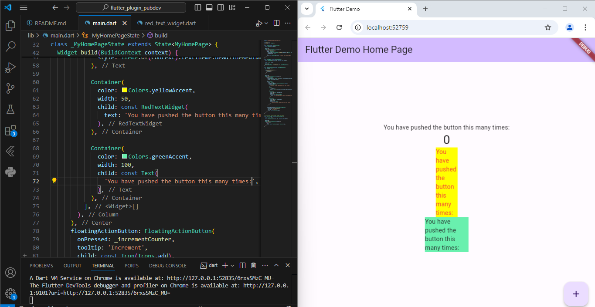

# Nama: Dela Farahita Zain
# NIM: 2241720058
# Kelas: D4 TI / 3B

1. Selesaikan Praktikum tersebut, lalu dokumentasikan dan push ke repository Anda berupa screenshot hasil pekerjaan beserta penjelasannya di file README.md!
## Langkah 1: Buat Project Baru

## Langkah 2: Menambahkan Plugin

## Langkah 3: Buat file red_text_widget.dart

## Langkah 4: Tambah Widget AutoSizeText

## Langkah 5: Buat Variabel text dan parameter di constructor

## Langkah 6: Tambahkan widget di main.dart

2. Jelaskan maksud dari langkah 2 pada praktikum tersebut!
Pada langkah 2, kita menambahkan plugin auto_size_text ke dalam project. Plugin auto_size_text berguna untuk menyesuaikan ukuran teks secara otomatis berdasarkan ruang yang tersedia. Dengan demikian, kita bisa membuat teks tetap terbaca dalam tampilan yang lebih kecil atau lebih besar tanpa memotong atau melebihi batas widget.

3. Jelaskan maksud dari langkah 5 pada praktikum tersebut!
Langkah 5 bertujuan untuk mendeklarasikan variabel text di dalam class RedTextWidget, dan menambahkannya sebagai parameter dalam constructor RedTextWidget. Hal ini memastikan bahwa setiap kali kita membuat RedTextWidget, kita dapat memberikan nilai text yang akan ditampilkan pada widget tersebut. Penambahan required this.text menandakan bahwa parameter text wajib diisi ketika widget ini digunakan.

4. Pada langkah 6 terdapat dua widget yang ditambahkan, jelaskan fungsi dan perbedaannya!
- Container 1:
    - Widget ini memiliki latar belakang berwarna kuning (yellowAccent) dan lebar 50.
    - Di dalamnya terdapat RedTextWidget yang menampilkan teks menggunakan plugin AutoSizeText, yang secara otomatis menyesuaikan ukuran teks sesuai ruang yang tersedia.
- Container 2:
    - Memiliki latar belakang berwarna hijau (greenAccent) dengan lebar 100.
    - Di dalamnya hanya terdapat widget Text biasa tanpa penyesuaian otomatis pada ukuran teks.

5. Jelaskan maksud dari tiap parameter yang ada di dalam plugin auto_size_text berdasarkan tautan pada dokumentasi ini !
- Usage: AutoSizeText berfungsi seperti widget Text biasa tetapi mampu menyesuaikan ukuran teks agar sesuai dengan batas yang ditentukan.
- maxLines: Menentukan jumlah baris maksimum yang akan digunakan untuk menampilkan teks. Jika maxLines tidak ditentukan, teks akan disesuaikan berdasarkan lebar dan tinggi yang tersedia.
- minFontSize & maxFontSize: Mengatur ukuran minimum dan maksimum font. minFontSize menentukan ukuran terkecil yang mungkin, sedangkan maxFontSize menentukan ukuran terbesar yang diizinkan. Jika presetFontSizes diatur, kedua parameter ini akan diabaikan.
- group: Memungkinkan sinkronisasi ukuran font dari beberapa widget AutoSizeText. Semua widget AutoSizeText dalam satu AutoSizeGroup akan menyesuaikan ukuran teks mereka berdasarkan ukuran terkecil dalam grup.
- stepGranularity: Menentukan besar langkah penurunan ukuran font saat menyesuaikan agar sesuai dengan batasan. Nilai yang rendah dapat mengurangi performa, sehingga disarankan untuk tidak mengaturnya di bawah 1.
- presetFontSizes: Membatasi ukuran font hanya pada nilai-nilai tertentu yang telah ditetapkan dalam daftar. Jika presetFontSizes diatur, parameter minFontSize, maxFontSize, dan stepGranularity akan diabaikan.
- overflowReplacement: Menyediakan widget pengganti jika teks meluap dan tidak dapat menyesuaikan batasan. Berguna untuk menghindari teks yang terlalu kecil dan sulit dibaca.
- Rich Text: Mendukung teks kaya seperti TextSpan dengan gaya teks yang berbeda atau tautan, menggunakan konstruktor AutoSizeText.rich().
